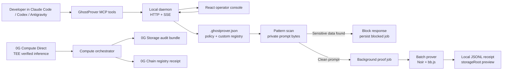

# GhostProver v2 — Generic ZK Compliance Engine

An enterprise-grade, privacy-preserving compliance attestation layer for AI inference. 

GhostProver v2 proves that sensitive data (like Aadhar numbers, PAN cards, AWS API keys, or Credit Card numbers) was **not** present in an AI prompt, without revealing the prompt or the sensitive data itself.

## Judge Quickstart

Run the background-agent demo in three terminals:

```bash
nvm use

# terminal 1: seed a clean judge-mode audit trail
npm run demo:judge

# terminal 2: start the local compliance daemon
npm run daemon

# terminal 3: start the React operator console
cd Frontend && npm run dev
```

Open `http://127.0.0.1:5173`, show the seeded receipt history, scan the clean sample, then scan the risk sample. For a real one-pattern proof acceptance run:

```bash
npm run test:proof:single
```

## How it works

A Zero-Knowledge (Noir) circuit proves:
1. The prover knows a prompt that hashes to a public **commitment**.
2. The prover checks the prompt against a generic **pattern** (e.g. `[DIGIT x 12]` for Aadhar).
3. The pattern does **not** appear anywhere in the prompt.
4. The pattern descriptor hashes to a public **pattern_hash**.

The result is a cryptographically verifiable **Batch Compliance Receipt** issued on-chain, proving to auditors that an entire preset of sensitive data classes was blocked from the AI pipeline.

## Architecture



## Features

- **Generic Pattern Matching**: 9 built-in character classes (`DIGIT`, `ALPHA`, `ALPHANUM`, `BASE64`, etc.) evaluated in-circuit.
- **Industry Presets**: Built-in registries for `india_kyc`, `banking`, `fintech`, `healthcare`, and `saas`, plus project-local custom registries.
- **Parallel Batch Prover**: Generates multiple non-inclusion proofs concurrently for a single prompt commitment.
- **On-chain Batch Receipts**: Smart contract logic (`submitBatchReceipt`) groups all proofs into a single gas-efficient transaction.
- **Express Middleware**: Drop-in `ghostProverMiddleware()` for automatic AI request interception and background attestation.
- **Background Agent + MCP**: Local daemon and MCP tools let coding-agent workflows scan, block, prove, and persist local receipts in the background.

## TypeScript SDK & CLI

GhostProver provides a full-featured TypeScript SDK and CLI to seamlessly integrate Zero-Knowledge proofs into your Node.js backend.

### CLI Usage
The easiest way to integrate GhostProver is via the CLI:
```bash
# Initialize a config file
npx ghostprover init

# Instantly scan a prompt against an industry preset (Zero-knowledge pre-flight)
npx ghostprover scan --preset banking --prompt "Patient query: SSN is 123456789"

# Generate parallel ZK Proofs for an entire preset
npx ghostprover prove --preset saas --prompt "Clean prompt with no API keys"

# Start the local background compliance agent
npm run daemon

# Start the MCP bridge for Claude Code / Codex / Antigravity-style tools
npm run mcp
```

Core docs:

- [`docs/background-agent-workflow.md`](docs/background-agent-workflow.md) — daemon/MCP workflow and flowchart.
- [`docs/api.md`](docs/api.md) — local daemon API contract.
- [`docs/mcp-setup.md`](docs/mcp-setup.md) — Claude Code / Codex / Antigravity MCP setup notes.
- [`docs/demo-script.md`](docs/demo-script.md) — 3-minute judge demo script.
- [`docs/limitations.md`](docs/limitations.md) — current limitations and winner-track upgrades.

Custom registry examples live in [`examples/custom-registry.json`](examples/custom-registry.json) and [`examples/.ghostprover.custom.example.json`](examples/.ghostprover.custom.example.json).

### Express Middleware
```typescript
import express from 'express';
import { ghostProverMiddleware } from 'ghostprover';

const app = express();

// Automatically intercepts AI prompts, runs a ZK pre-flight scan,
// and orchestrates background proof generation if the prompt is clean.
app.use('/v1/chat/completions', ghostProverMiddleware({
  preset: 'india_kyc',
  blocking: false // Return response immediately, prove in background
}));
```


## Noir CLI Quick Start

If you want to manually test or compile the zero-knowledge circuits using standard Noir tools:
```bash
# Prerequisites: nargo v1.0.0-beta.20, bb (Barretenberg CLI)

cd Circuit/ghostprover

# Run tests (12 test cases including edge cases)
nargo test

# Execute the circuit with Prover.toml inputs
nargo execute

# Generate proof + Solidity verifier
bb prove -b ./target/ghostprover.json -w ./target/ghostprover.gz -o ./target --oracle_hash keccak
bb write_vk -b ./target/ghostprover.json -o ./target --oracle_hash keccak
bb write_solidity_verifier -k ./target/vk -o ./target/Verifier.sol
```

## Local receipt demo

This repository also includes a **demo-mode** local receipt flow. It proves the
ZK proof can be generated and verified on-chain locally without spending
mainnet funds.

```bash
# terminal 1
anvil

# terminal 2
cd Compute
npm run demo:deploy

# terminal 3
npm run demo:receipt
```

Generate a fresh proof fixture and run the local receipt tests with one command:

```bash
cd Compute
npm run demo:test
```

The demo test flow covers:
- valid proof emits `ComplianceReceiptIssued`
- tampered proof is rejected
- tampered commitment is rejected
- tampered target hash is rejected

## Demo limitations

The local receipt demo is intentionally partial:

- The prompt and target are hardcoded local sample inputs.
- There is no live 0G provider in the flow.
- There is no TEE attestation, `zerogAuth`, or `processResponse()` verification.
- There is no 0G Storage upload or storage root.
- The chain target is local Anvil, not 0G Chain.
- The verifier artifact is reused from the checked-in Noir output.

For the full live path, use the 0G mainnet runbook below.

## 0G mainnet runbook

Use Node 20+ for the current 0G Compute SDKs.

```bash
nvm use

# terminal 1: configure live Compute
cd Compute
cp .env.example .env
# Fill PRIVATE_KEY. Keep ZG_NETWORK=mainnet and ZG_RPC_URL=https://evmrpc.0g.ai.
npm install
npm run list-services
npm run attest
npm run inference -- "In one sentence, explain zero-knowledge proofs."

# terminal 2: deploy the receipt registry to 0G mainnet
cd Chain
forge script script/Deploy0G.s.sol:Deploy0G \
  --rpc-url https://evmrpc.0g.ai \
  --private-key $PRIVATE_KEY \
  --broadcast

# terminal 3: submit a GhostProver receipt for the latest live sample
cd Compute
# copy Chain/deployments/0g-mainnet.json registry into REGISTRY_ADDRESS first
npm run orchestrate -- --preset saas
```

If an SDK cannot auto-detect mainnet contracts, set `ZG_LEDGER_CA`,
`ZG_INFERENCE_CA`, and `ZG_FINE_TUNING_CA` in `Compute/.env`. Live receipt
submission refuses unverified TEE samples unless `--allow-unverified` is passed.


```text
├── src/
│   ├── ghostprover.ts    # Main SDK wrapper (`generatePatternProof`, etc.)
│   ├── batch-prover.ts   # Parallel proof orchestration & pre-flight scans
│   ├── cli.ts            # GhostProver terminal interface
│   ├── middleware.ts     # Express.js drop-in integration
│   ├── poseidon2.ts      # Pure TypeScript BN254 zero-knowledge hashing
│   ├── registry/         # Industry presets and pattern definitions
│   └── agent/            # Daemon, MCP bridge, local store, judge/test scripts
├── Circuit/ghostprover/
│   ├── src/main.nr       # ZK circuit (Dual-mode non-inclusion + character classes)
│   └── target/           # Auto-generated verification keys & Solidity Verifier
├── Chain/
│   ├── src/GhostProverRegistry.sol   # Batch receipt registry
│   └── test/GhostProverRegistry.t.sol
├── Frontend/
│   └── src/              # React operator console connected to the daemon
├── docs/
│   ├── background-agent-workflow.md  # Daemon/MCP workflow and flowchart
│   ├── api.md                       # Local daemon API
│   ├── mcp-setup.md                 # Coding-agent integration setup
│   ├── demo-script.md               # Hackathon demo script
│   └── limitations.md               # Known limitations and next upgrades
├── examples/
│   ├── custom-registry.json         # Company-specific registry example
│   └── .ghostprover.custom.example.json
└── Compute/
    ├── src/mock-inference.ts         # TEE envelope simulation
    └── src/orchestrator.ts           # Full inference + attestation pipeline
```

## License

MIT
