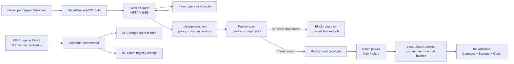

<p align="center">
  
</p>

<h1 align="center">GhostProver — Zero-Knowledge Compliance for AI Inference</h1>

<p align="center">
  <a href="./README.md">English</a> | <a href="./README.zh-CN.md">简体中文</a>
</p>

GhostProver is a privacy-preserving compliance layer for AI workflows built around Zero-Knowledge proofs and the 0G stack.

It proves that sensitive data such as Aadhaar numbers, PAN cards, API keys, credit card numbers, and other regulated identifiers were **not** present in an AI prompt, without revealing the prompt itself.

The result is a verifiable compliance receipt that can be generated locally, archived, and anchored on-chain.

## Judge Quickstart

Run the background-agent demo in three terminals:

```bash
nvm use

# terminal 1: seed a clean judge-mode audit trail
npm run demo:judge

# terminal 2: start the local compliance daemon
npm run daemon

# terminal 3: start the React operator console
cd Frontend
npm run dev
```

Open `http://127.0.0.1:5173`, inspect the seeded receipt history, scan the clean sample, then scan the risk sample.

For a real one-pattern proof acceptance run:

```bash
npm run test:proof:single
```

## What GhostProver Proves

At the core of GhostProver is a Noir circuit that proves:

1. the prover knows a prompt that hashes to a public **commitment**
2. the prompt was checked against a sensitive-data rule
3. the target string or pattern does **not** appear anywhere in the prompt
4. the exact rule checked hashes to a public **pattern hash**

This lets verifiers confirm a compliance property about the prompt without learning the prompt contents.

## Architecture



## Key Features

- **Generic Pattern Matching**: 9 built-in character classes such as `DIGIT`, `ALPHA`, `ALPHANUM`, `HEX`, and `BASE64` are evaluated in-circuit.
- **Industry Presets**: bundled registries for `india_kyc`, `banking`, `fintech`, `healthcare`, and `saas`, plus support for custom company registries.
- **Parallel Batch Prover**: multiple non-inclusion proofs can be generated concurrently for a single prompt commitment.
- **On-Chain Batch Receipts**: smart contract logic groups multiple proofs into a single compliance receipt flow.
- **SDK, CLI, and Middleware**: GhostProver can be embedded into Node.js systems, terminal workflows, and HTTP middleware.
- **Background Agent + MCP**: a local daemon, MCP bridge, and operator console make the system usable in real agent-assisted workflows.

## How GhostProver Uses 0G

GhostProver is designed to span the major layers of the 0G stack instead of using only one isolated component.

### 1. 0G Private Compute / Compute Network

The Compute integration is responsible for running inference through 0G-backed infrastructure and capturing TEE-related metadata used by the compliance flow.

In the repository, the `Compute/` workspace handles:

- live and mock inference capture
- provider discovery and attestation inspection
- request and response logging
- orchestration of the prompt -> proof -> receipt pipeline

Key files:

- [`Compute/src/inference.ts`](Compute/src/inference.ts)
- [`Compute/src/attestation.ts`](Compute/src/attestation.ts)
- [`Compute/src/verify-attestation.ts`](Compute/src/verify-attestation.ts)
- [`Compute/src/orchestrator.ts`](Compute/src/orchestrator.ts)

The Compute layer is where GhostProver collects the inference-side evidence needed to pair TEE-backed execution with ZK-based compliance proofs.

### 2. 0G Storage

GhostProver uses 0G Storage as the archival layer for audit bundles.

An audit bundle can include:

- the captured inference log
- TEE-related metadata
- public proof inputs
- proof material or proof references
- timestamps and receipt metadata

The Storage adapter computes or uploads a storage root that can later be referenced by the receipt layer.

Key file:

- [`Compute/src/storage.ts`](Compute/src/storage.ts)

### 3. 0G Chain

0G Chain is used as the settlement and receipt layer.

Once a proof is generated, GhostProver can submit it to the on-chain registry, where the Solidity verifier checks the proof and emits a compliance receipt event.

That receipt can bind together:

- prompt commitment
- target or pattern hash
- provider and model metadata
- storage root
- submission timestamp

Key files:

- [`Chain/src/GhostProverRegistry.sol`](Chain/src/GhostProverRegistry.sol)
- [`Chain/src/generated/Verifier.sol`](Chain/src/generated/Verifier.sol)
- [`Chain/script/Deploy0G.s.sol`](Chain/script/Deploy0G.s.sol)

### 4. Why the 0G pairing matters

GhostProver is not only a ZK proof library and not only a TEE wrapper.

The product is built around the combination of:

- **0G Compute** for verifiable inference context
- **Zero-Knowledge proofs** for privacy-preserving compliance claims
- **0G Storage** for durable audit archival
- **0G Chain** for independently verifiable receipts

That combination is what turns a prompt-compliance check into a reusable compliance artifact.

## TypeScript SDK and CLI

GhostProver provides a TypeScript SDK and CLI for integrating Zero-Knowledge compliance checks into Node.js applications and developer tooling.

### CLI Usage

```bash
# Initialize a local config file
npx ghostprover init

# Instantly scan a prompt against an industry preset
npx ghostprover scan --preset banking --prompt "Patient query: SSN is 123456789"

# Generate parallel ZK proofs for an entire preset
npx ghostprover prove --preset saas --prompt "Clean prompt with no API keys"

# Start the local background compliance daemon
npm run daemon

# Start the MCP bridge for Claude Code / Codex style tools
npm run mcp
```

Core documentation:

- [`docs/background-agent-workflow.md`](docs/background-agent-workflow.md) — daemon and MCP architecture
- [`docs/api.md`](docs/api.md) — local daemon API contract
- [`docs/mcp-setup.md`](docs/mcp-setup.md) — MCP setup notes
- [`docs/demo-script.md`](docs/demo-script.md) — demo walkthrough

Custom registry examples:

- [`examples/custom-registry.json`](examples/custom-registry.json)
- [`examples/.ghostprover.custom.example.json`](examples/.ghostprover.custom.example.json)

### Express Middleware

```typescript
import express from 'express';
import { ghostProverMiddleware } from 'ghostprover';

const app = express();

app.use('/v1/chat/completions', ghostProverMiddleware({
  preset: 'india_kyc',
  blocking: false,
}));
```

The middleware performs a fast pre-flight scan and can queue background proof generation for clean prompts.

## Local Daemon and Operator Workflow

GhostProver also ships with a local daemon that acts as the source of truth for:

- scans
- attest requests
- queued proof jobs
- persisted receipts
- live workflow updates over SSE

This makes it suitable for agent tooling, internal operator consoles, and local compliance workflows without requiring a custom backend from day one.

Related components:

- [`src/agent/daemon.ts`](src/agent/daemon.ts)
- [`src/agent/mcp-server.ts`](src/agent/mcp-server.ts)
- [`Frontend/src/App.jsx`](Frontend/src/App.jsx)

## Noir CLI Quick Start

If you want to work directly with the Noir circuit:

```bash
# Prerequisites: nargo and bb / Barretenberg CLI
cd Circuit/ghostprover

# Run circuit tests
nargo test

# Execute with Prover.toml inputs
nargo execute

# Generate proof and Solidity verifier
bb prove -b ./target/ghostprover.json -w ./target/ghostprover.gz -o ./target --oracle_hash keccak
bb write_vk -b ./target/ghostprover.json -o ./target --oracle_hash keccak
bb write_solidity_verifier -k ./target/vk -o ./target/Verifier.sol
```

## Local Receipt Demo

This repository also includes a **demo-mode** local receipt flow. It proves the
ZK proof can be generated and verified on-chain locally without spending
mainnet funds.

```bash
# terminal 1
anvil

# terminal 2
cd Compute
npm run demo:deploy

# terminal 3
npm run demo:receipt
```

You can also generate a fresh proof fixture and run the local receipt tests with:

```bash
cd Compute
npm run demo:test
```

This covers:

- valid proof acceptance
- tampered proof rejection
- tampered commitment rejection
- tampered target hash rejection

## 0G Mainnet Runbook

For the full live path, use the 0G mainnet runbook below.
Use Node 20+ for the current 0G Compute tooling.

### 1. Configure live Compute

```bash
nvm use

# terminal 1: configure live Compute
cd Compute
cp .env.example .env
# Fill PRIVATE_KEY and mainnet configuration values
npm install
npm run list-services
npm run attest
npm run inference -- "In one sentence, explain zero-knowledge proofs."
```

### 2. Deploy the receipt registry to 0G mainnet

```bash
cd Chain
forge script script/Deploy0G.s.sol:Deploy0G \
  --rpc-url https://evmrpc.0g.ai \
  --private-key $PRIVATE_KEY \
  --broadcast
```

### 3. Submit a GhostProver receipt for the captured sample

```bash
cd Compute
# copy Chain/deployments/0g-mainnet.json registry into REGISTRY_ADDRESS first
npm run orchestrate -- --preset saas
```

If an SDK cannot auto-detect the correct chain contracts, set the relevant Compute contract addresses in `Compute/.env`.

## Repository Layout

```text
├── src/
│   ├── ghostprover.ts
│   ├── batch-prover.ts
│   ├── cli.ts
│   ├── middleware.ts
│   ├── poseidon2.ts
│   ├── registry/
│   └── agent/
├── Circuit/
│   └── ghostprover/
│       ├── src/main.nr
│       └── target/
├── Chain/
│   ├── src/GhostProverRegistry.sol
│   └── test/GhostProverRegistry.t.sol
├── Compute/
│   ├── src/
│   └── reports/
├── Frontend/
│   └── src/
├── docs/
│   ├── background-agent-workflow.md
│   ├── api.md
│   ├── mcp-setup.md
│   ├── demo-script.md
│   ├── project-plan.md
│   ├── implementation-log.md
│   └── handoff-summary.md
├── examples/
└── scripts/
```

## Repository Guide

If you are navigating the repository for the first time, these are the most useful entry points:

- [`src/README.md`](src/README.md) — TypeScript SDK, CLI, middleware, daemon, and registry overview
- [`Circuit/README.md`](Circuit/README.md) — Noir circuit workspace overview
- [`Chain/README.md`](Chain/README.md) — Solidity verifier and receipt registry flow
- [`Compute/README.md`](Compute/README.md) — 0G Compute, attestation, storage, and orchestration helpers
- [`Frontend/README.md`](Frontend/README.md) — React operator console overview
- [`docs/README.md`](docs/README.md) — documentation index
- [`examples/README.md`](examples/README.md) — custom registry and config examples
- [`scripts/README.md`](scripts/README.md) — repository helper scripts

Additional project documents:

- [`docs/project-plan.md`](docs/project-plan.md) — original build plan and hackathon context
- [`docs/implementation-log.md`](docs/implementation-log.md) — milestone log and implementation history
- [`docs/handoff-summary.md`](docs/handoff-summary.md) — concise continuation brief

## License

MIT
