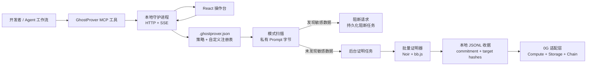

<p align="center">
  
</p>

<h1 align="center">GhostProver — 面向 AI 推理的零知识合规层</h1>

<p align="center">
  <a href="./README.md">English</a> | <a href="./README.zh-CN.md">简体中文</a>
</p>

GhostProver 是一个围绕零知识证明与 0G 技术栈构建的隐私保护型 AI 合规层。

它可以证明：在不泄露原始 Prompt 的前提下，AI Prompt 中**不包含**诸如身份证号、PAN 卡号、API Key、银行卡号等敏感数据。

最终产物是一个可验证的合规凭证，可在本地生成、归档，并上链锚定。

## 评审快速体验

在三个终端中分别运行：

```bash
# 终端 1：生成评审模式的本地审计数据
npm run demo:judge

# 终端 2：启动本地合规守护进程
npm run daemon

# 终端 3：启动 React 操作台
cd Frontend
npm run dev
```

打开 `http://127.0.0.1:5173`，查看预置的收据历史，先扫描安全样例，再扫描风险样例。

若要运行一次真实的单模式证明验收流程：

```bash
npm run test:proof:single
```

## GhostProver 证明什么

GhostProver 的 Noir 电路会证明：

1. 证明者知道一个 Prompt，其哈希等于公开的 **commitment**
2. 该 Prompt 已按照某条敏感数据规则进行检查
3. 目标字符串或目标模式**没有**出现在 Prompt 中
4. 被检查的规则本身会绑定到公开的 **pattern hash**

因此，验证者可以确认 Prompt 满足某个合规条件，而不会看到 Prompt 内容本身。

## 架构



## 可视化概览

仓库现在在 [`docs/assets/`](docs/assets/README.zh-CN.md) 下提供了适合演示与说明的图示资源。

### 架构总览


### 单个 Prompt 决策流程


### ZK 证明生命周期


## 核心特性

- **通用模式匹配**：内置 `DIGIT`、`ALPHA`、`ALPHANUM`、`HEX`、`BASE64` 等 9 类字符类别，并在电路中进行验证
- **行业预设**：内置 `india_kyc`、`banking`、`fintech`、`healthcare`、`saas` 等规则集，同时支持企业自定义注册表
- **并行批量证明**：针对同一个 Prompt commitment，可并行生成多个非包含性证明
- **链上批量收据**：合约支持将多个证明合并为一条合规收据流程
- **SDK、CLI 与 Middleware**：可嵌入 Node.js 服务、命令行流程以及 HTTP 中间件
- **后台 Agent + MCP**：通过本地守护进程、MCP 桥接和操作台支持真实的 Agent 工作流

## GhostProver 如何使用 0G

GhostProver 的设计目标不是只接入 0G 的单一组件，而是跨越 0G 技术栈的多个层级。

### 1. 0G Private Compute / Compute Network

Compute 集成负责通过 0G 相关基础设施执行推理，并捕获合规流程所需的 TEE 元数据。

在仓库中，`Compute/` 工作区负责：

- 实时推理与模拟推理日志捕获
- Provider 发现与远程度量/证明信息检查
- 请求与响应记录
- Prompt 到 Proof 到 Receipt 的完整编排

关键文件：

- [`Compute/src/inference.ts`](Compute/src/inference.ts)
- [`Compute/src/attestation.ts`](Compute/src/attestation.ts)
- [`Compute/src/verify-attestation.ts`](Compute/src/verify-attestation.ts)
- [`Compute/src/orchestrator.ts`](Compute/src/orchestrator.ts)

### 2. 0G Storage

GhostProver 使用 0G Storage 作为审计包归档层。

审计包可以包含：

- 推理日志
- TEE 相关元数据
- 证明的公开输入
- 证明内容或证明引用
- 时间戳与收据元数据

Storage 适配层负责生成或上传 storage root，以便后续被收据层引用。

关键文件：

- [`Compute/src/storage.ts`](Compute/src/storage.ts)

### 3. 0G Chain

0G Chain 是 GhostProver 的结算与收据发布层。

证明生成后，GhostProver 可将其提交到链上 Registry，由 Solidity Verifier 验证证明并发出合规收据事件。

该收据可绑定：

- Prompt commitment
- 目标或模式哈希
- Provider 与模型元数据
- Storage root
- 提交时间戳

关键文件：

- [`Chain/src/GhostProverRegistry.sol`](Chain/src/GhostProverRegistry.sol)
- [`Chain/src/generated/Verifier.sol`](Chain/src/generated/Verifier.sol)
- [`Chain/script/Deploy0G.s.sol`](Chain/script/Deploy0G.s.sol)

### 4. 为什么 0G 的组合很重要

GhostProver 既不是单纯的 ZK 证明库，也不是单纯的 TEE 封装。

它真正的产品能力来自以下组合：

- **0G Compute**：提供可验证的推理上下文
- **零知识证明**：提供隐私保护的合规声明
- **0G Storage**：提供持久化审计归档
- **0G Chain**：提供独立可验证的合规收据

这种组合让一次 Prompt 合规检查，最终变成一个可以被复用和验证的合规工件。

## TypeScript SDK 与 CLI

GhostProver 提供 TypeScript SDK 与 CLI，便于将零知识合规校验集成到 Node.js 应用与开发者工具中。

### CLI 使用方式

```bash
# 初始化本地配置
npx ghostprover init

# 针对行业预设快速扫描 Prompt
npx ghostprover scan --preset banking --prompt "Patient query: SSN is 123456789"

# 为整套预设生成并行 ZK 证明
npx ghostprover prove --preset saas --prompt "Clean prompt with no API keys"

# 启动本地合规守护进程
npm run daemon

# 启动 MCP 桥接
npm run mcp
```

核心文档：

- [`docs/background-agent-workflow.md`](docs/background-agent-workflow.md) — 守护进程与 MCP 架构
- [`docs/api.md`](docs/api.md) — 本地守护进程 API
- [`docs/mcp-setup.md`](docs/mcp-setup.md) — MCP 集成说明
- [`docs/demo-script.md`](docs/demo-script.md) — Demo 演示脚本

自定义注册表示例：

- [`examples/custom-registry.json`](examples/custom-registry.json)
- [`examples/.ghostprover.custom.example.json`](examples/.ghostprover.custom.example.json)

### Express Middleware

```typescript
import express from 'express';
import { ghostProverMiddleware } from 'ghostprover';

const app = express();

app.use('/v1/chat/completions', ghostProverMiddleware({
  preset: 'india_kyc',
  blocking: false,
}));
```

该中间件会先执行快速预扫描，并可对通过检查的 Prompt 在后台排队生成证明。

## 本地守护进程与操作台

GhostProver 同时提供本地守护进程，作为以下能力的事实来源：

- 扫描结果
- attest 请求
- 证明任务队列
- 已持久化的收据
- 基于 SSE 的实时进度

因此，无需从第一天起就自建后端，也可以将其用于 Agent 工具、内部操作台和本地合规流程。

相关组件：

- [`src/agent/daemon.ts`](src/agent/daemon.ts)
- [`src/agent/mcp-server.ts`](src/agent/mcp-server.ts)
- [`Frontend/src/App.jsx`](Frontend/src/App.jsx)

## Noir CLI 快速开始

如果你希望直接操作 Noir 电路：

```bash
cd Circuit/ghostprover

# 运行电路测试
nargo test

# 使用 Prover.toml 执行
nargo execute

# 生成证明与 Solidity verifier
bb prove -b ./target/ghostprover.json -w ./target/ghostprover.gz -o ./target --oracle_hash keccak
bb write_vk -b ./target/ghostprover.json -o ./target --oracle_hash keccak
bb write_solidity_verifier -k ./target/vk -o ./target/Verifier.sol
```

## 本地收据 Demo

仓库内提供了本地 proof-to-contract Demo 流程，用于快速验证收据链路。

```bash
# 终端 1
anvil

# 终端 2
cd Compute
npm run demo:deploy

# 终端 3
npm run demo:receipt
```

也可以使用以下命令生成新的证明 fixture 并运行本地收据测试：

```bash
cd Compute
npm run demo:test
```

该流程会覆盖：

- 有效证明通过
- 篡改 proof 被拒绝
- 篡改 commitment 被拒绝
- 篡改 target hash 被拒绝

## 0G 主网运行指南

当前 0G Compute 工具建议使用 Node 20+。

### 1. 配置实时 Compute

```bash
cd Compute
cp .env.example .env
# 填入 PRIVATE_KEY 与主网配置
npm install
npm run list-services
npm run attest
npm run inference -- "In one sentence, explain zero-knowledge proofs."
```

### 2. 将收据 Registry 部署到 0G 主网

```bash
cd Chain
forge script script/Deploy0G.s.sol:Deploy0G \
  --rpc-url https://evmrpc.0g.ai \
  --private-key $PRIVATE_KEY \
  --broadcast
```

### 3. 为捕获到的样本提交 GhostProver 收据

```bash
cd Compute
# 先把 Chain/deployments/0g-mainnet.json 中的 registry 地址写入 REGISTRY_ADDRESS
npm run orchestrate -- --preset saas
```

如果 SDK 无法自动识别正确的链上合约地址，请在 `Compute/.env` 中显式设置相关 Compute 合约地址。

## 仓库结构

```text
├── src/
│   ├── ghostprover.ts
│   ├── batch-prover.ts
│   ├── cli.ts
│   ├── middleware.ts
│   ├── poseidon2.ts
│   ├── registry/
│   └── agent/
├── Circuit/
│   └── ghostprover/
│       ├── src/main.nr
│       └── target/
├── Chain/
│   ├── src/GhostProverRegistry.sol
│   └── test/GhostProverRegistry.t.sol
├── Compute/
│   ├── src/
│   └── reports/
├── Frontend/
│   └── src/
├── docs/
│   ├── background-agent-workflow.md
│   ├── api.md
│   ├── mcp-setup.md
│   ├── demo-script.md
│   ├── project-plan.md
│   ├── implementation-log.md
│   └── handoff-summary.md
├── examples/
└── scripts/
```

## 仓库导览

如果你是第一次阅读这个仓库，推荐从以下入口开始：

- [`src/README.zh-CN.md`](src/README.zh-CN.md) — TypeScript SDK、CLI、middleware、daemon 与 registry 概览
- [`Circuit/README.zh-CN.md`](Circuit/README.zh-CN.md) — Noir 电路工作区说明
- [`Chain/README.zh-CN.md`](Chain/README.zh-CN.md) — 链上 verifier 与收据注册表说明
- [`Compute/README.zh-CN.md`](Compute/README.zh-CN.md) — 0G Compute、attestation、storage 与 orchestration 说明
- [`Frontend/README.zh-CN.md`](Frontend/README.zh-CN.md) — React 操作台说明
- [`docs/README.zh-CN.md`](docs/README.zh-CN.md) — 文档目录
- [`examples/README.zh-CN.md`](examples/README.zh-CN.md) — 自定义注册表与配置示例
- [`scripts/README.zh-CN.md`](scripts/README.zh-CN.md) — 仓库辅助脚本说明

其他项目文档：

- [`docs/project-plan.md`](docs/project-plan.md) — 原始项目规划与 Hackathon 背景
- [`docs/implementation-log.md`](docs/implementation-log.md) — 里程碑与实现日志
- [`docs/handoff-summary.md`](docs/handoff-summary.md) — 简明交接文档

## 许可证

MIT
