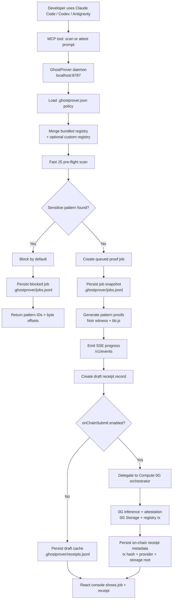

# GhostProver Background Agent Workflow

GhostProver now has two layers:

- **ZK compliance core**: the Noir circuit, pattern registry, scanner, and batch prover.
- **Background agent**: a local daemon, JSONL draft queue, MCP bridge, and React console.

The daemon is the local source of truth. Agent products such as Claude Code,
Codex, and Antigravity should call the MCP tools, while the MCP server forwards
all policy decisions to the daemon. The React console also reads from the daemon
so developers see the same jobs and receipts that agent tools create.

## Workflow



## Runtime API

| Endpoint | Purpose |
|---|---|
| `GET /health` | Check daemon availability. |
| `GET /v1/status` | Read health, effective policy, counts, latest job, and latest receipt. |
| `GET /v1/config` | Return effective local policy. |
| `GET /v1/presets` | Return merged presets and patterns. |
| `POST /v1/scan` | Scan a prompt without proving. |
| `POST /v1/attest` | Scan and enqueue proofs if clean. |
| `GET /v1/jobs` | List recent persisted job snapshots. |
| `GET /v1/jobs/:id` | Read the latest snapshot for a job. |
| `GET /v1/receipts` | List receipt records from the daemon cache. |
| `GET /v1/events` | Stream job and receipt updates over SSE. |

## Local Files

```text
.ghostprover.json            # Company policy, generated by ghostprover init
.ghostprover/jobs.jsonl      # Append-only job snapshots, git-ignored
.ghostprover/receipts.jsonl  # Draft/on-chain receipt records, git-ignored
```

## Commands

```bash
npm run daemon
npm run mcp
npm run cli -- scan --preset saas --prompt "hello world"
```

By default the daemon writes draft receipt records so development is fast and
does not require a funded key. These drafts are a queue/debug cache, not the
final compliance artifact. When `onChainSubmit` is enabled, the same
`/v1/attest` flow delegates final submission to the Compute 0G orchestrator and
stores the resulting transaction hash, provider, model, and 0G Storage root.
