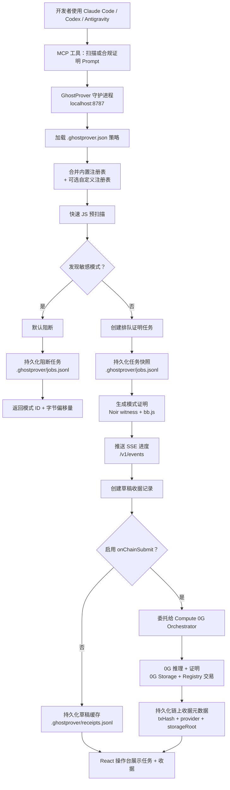

# GhostProver 后台 Agent 工作流

GhostProver 分为两个核心层：

- **ZK 合规核心**：Noir 电路、模式注册表、扫描器与批量证明器。
- **后台 Agent**：本地守护进程、JSONL 草稿队列、MCP 桥接与 React 操作台。

守护进程是本地的事实来源。Claude Code、Codex、Antigravity 等 Agent 产品应调用 MCP 工具，MCP 服务器会将所有策略决策转发给守护进程。React 操作台同样从守护进程读取数据，因此开发者与 Agent 工具看到的是同一份任务和收据列表。

## 工作流程图



## 运行时 API

| 接口 | 说明 |
|---|---|
| `GET /health` | 检查守护进程是否可用。 |
| `GET /v1/status` | 读取健康状态、生效策略、统计信息、最新任务和最新收据。 |
| `GET /v1/config` | 返回当前生效的本地策略。 |
| `GET /v1/presets` | 返回合并后的预设规则与模式列表。 |
| `POST /v1/scan` | 扫描 Prompt，不生成证明。 |
| `POST /v1/attest` | 扫描并在无风险时排队生成证明。 |
| `GET /v1/jobs` | 列出最近持久化的任务快照。 |
| `GET /v1/jobs/:id` | 读取指定任务的最新快照。 |
| `GET /v1/receipts` | 列出守护进程缓存中的收据记录。 |
| `GET /v1/events` | 通过 SSE 推送任务与收据的实时更新。 |

## 本地文件

```text
.ghostprover.json            # 公司策略，由 ghostprover init 生成
.ghostprover/jobs.jsonl      # 追加式任务快照，已 git-ignore
.ghostprover/receipts.jsonl  # 草稿/链上收据记录，已 git-ignore
```

## 常用命令

```bash
npm run daemon
npm run mcp
npm run cli -- scan --preset saas --prompt "hello world"
```

默认情况下，守护进程写入草稿收据记录，开发时无需资金账户即可快速验证流程。这些草稿是调试队列缓存，并非最终合规工件。当启用 `onChainSubmit` 后，相同的 `/v1/attest` 流程会将最终提交委托给 Compute 0G Orchestrator，并将交易哈希、Provider、模型和 0G Storage root 存入收据记录。
