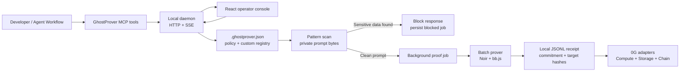
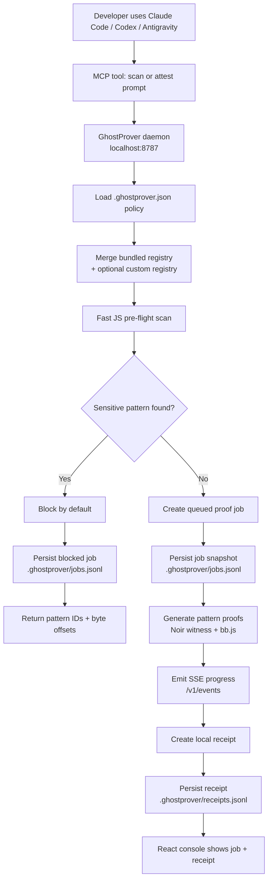
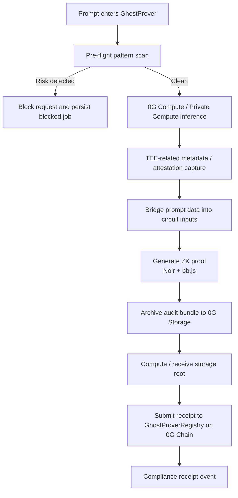
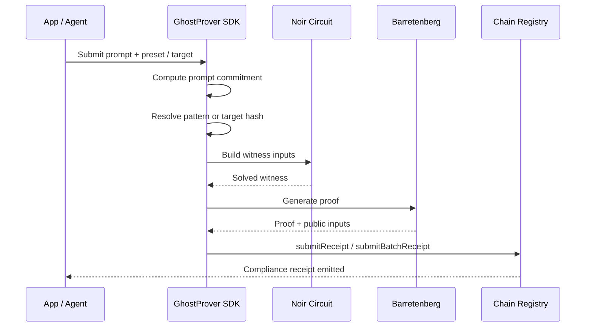
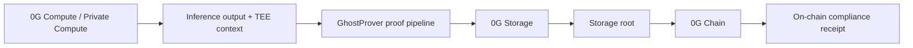
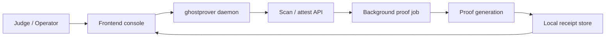
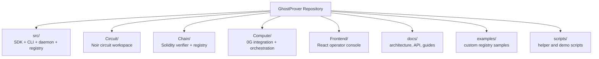
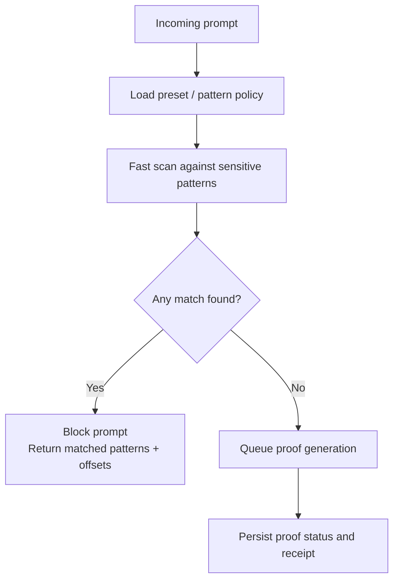

# GhostProver Diagrams

This file collects Mermaid diagrams that explain the main technical flows in GhostProver.

Use these diagrams for:

- project walkthroughs
- hackathon or judge presentations
- onboarding contributors
- architecture discussions
- social or technical documentation drafts

## 1. High-Level Product Architecture

## 2. Background Agent Workflow

## 3. End-to-End 0G Flow

## 4. ZK Proof Lifecycle

## 5. 0G Component Mapping

## 6. Local Demo Flow

## 7. Repository Structure Map

## 8. Single Prompt Decision Flow

## Notes

- These diagrams are documentation assets only.
- They are intentionally high level and should be paired with the more detailed docs in this folder when needed.
- For runtime/API specifics, see [`api.md`](api.md) and [`background-agent-workflow.md`](background-agent-workflow.md).
